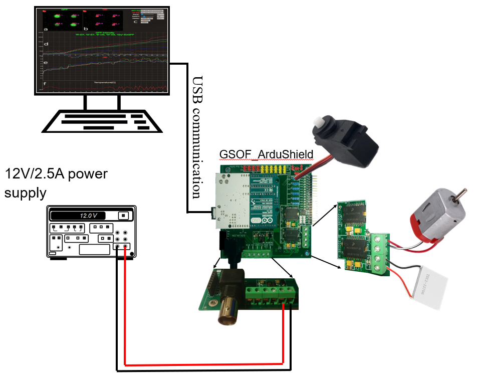
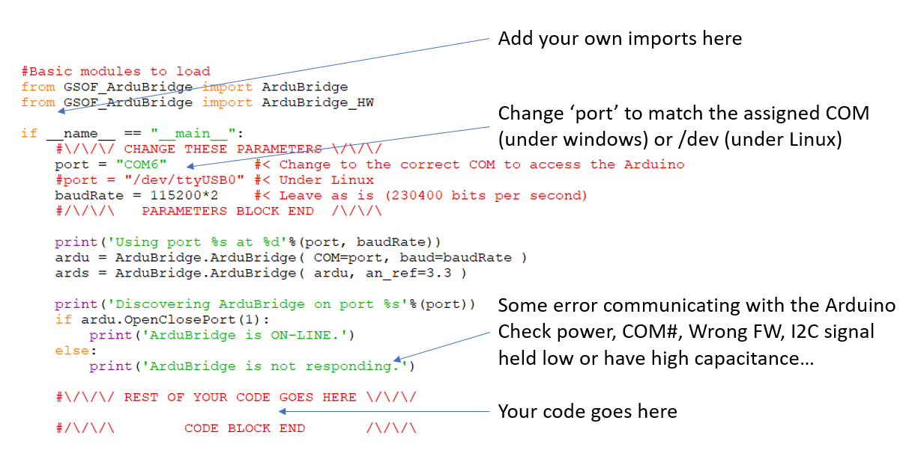

# Introduction
The ArduBridge (GSOF_ArduBridge) is a software designed to be a bridge between python and an Arduino.
The ArduShield (GSOF_ArduShield) is an expansion board for the Arduino Uno R3 that adds additional features and connectors to attach devices such as servos, DC motors, analog sensors, high-power actuators, etc.
The main computer run the python script and the ArduBridge send the commands to the Arduino over USB(RS232). This provides a convinient way to develop real-time algorithms on the main computer and use of the sensors and others(change that) via abd Arduino.. In addition, the electronic hardware can be used without the ArduBridge software by programming the Arduino directly in C/C++.

# Shield hardware
The ArduShield includes a dual H-bridge capable of driving:
	DC motors.
	Thermo Electric Coolers (TEC).
	Other high-power devices up to 12V / 2A.
In addition, the onboard 5V regulator eliminates the need to supply a precise voltage to drive the external peripherals and to prevent overloading the USB host.
    The ArduShield also includes connectors for easy connection of servos, analog sensors, General Input Output port (GPIO), and devices over the Serial-Peripheral-Interface (SPI) or Inter-Integrated-Circuit I2C bus.
    Although the ArduShield can be used in various projects, it was initially designed to encapsulate the electronic circuits used in Digital-Microfluidics (DMF) setup. A unique feature of the shield is the capability to stack up additional extension boards (e.g., the Digital-Microfluidics (DMF) electrode driver) without the need for extra cables and workbench space. Another unique capability is its ability to measure the impedance between any DMF electrode and the Indium-Tin-Oxide (ITO) plate. This is extremely useful for detecting faults in droplets and estimating droplet size.
Each chapter will show the electrical circuit of each block and include an explanation regarding its electrical functionality and its respective Python classes.

# Installation and hardware setup
The ArduBridge Python model is a standard package installation while the firmware that runs on the Arduino is installed by procedure called programming or uploading.
## Firmware upload
To program the Arduino with the compiled firmware (FW), use the xloader application (https://github.com/xinabox/xLoader):
1.	Open the xloader application.
2.	Select the COM port that the Arduino Uno R3 is connected to.
3.	Select the Hex file "Bridge_Ctrl_Vxx.ino.hex" (or the most updated FW you have).
4.	Press the "Upload" button and wait for the programming operation to finish after a few seconds.

## Python modules installation
Before installing the ArduShield module, make sure Python 3.7 or above is installed (https://www.python.org/) together with the latest pyserial module  (https://pyserial.readthedocs.io/en/latest/pyserial.html). Installation of the ArduBridge can be done in two ways:
1.	By double clicking the setup.bat batch file.
2.	By running the setup.py script in a command prompt ("CMD") window.

# Documentation and example code
A detailed user manual can be found under the Documentation folder.
Code example are present under the Example folder.

Update the COM port in ArduBridge_IDE.py and run in interactive mode (e.g. useing IDLE and F5).
You can interact the Arduino using the ardu and ards objects (refer to the tutorial for further information).
 
# Acknowledgements
I want to thank the following beta testers for their valuable contributions in the developent of the ArduBridge program:
James Perry, Laura Leclerc, Kenza Samlali, Tzur Soffer, and Sam Little.
Their feedback and suggestions were instrumental in identifying and resolving any issues in the program. I would especially like to acknowledge James Perry for using the Ardubridge in all of his academic publications and teaching new students how to use it as well.
